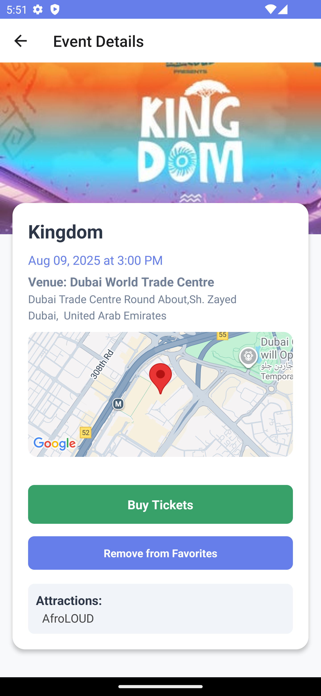

# CityPulse - Local Events Explorer

A React Native mobile application that helps users discover and explore local events using the Ticketmaster Discovery API. The app features biometric authentication, multilingual support (English/Arabic), and a modern, intuitive user interface.

## 📱 Screenshots

### App Screenshots


_Splash screen with app branding_


_Biometric authentication screen_


_Home screen with search functionality_


_Event details with map preview_


_Favorites screen with saved events_


_User profile with language toggle_

## 📋 Prerequisites

Before running this project, make sure you have the following installed:

- **Node.js** (v18 or higher)
- **React Native CLI** or **Expo CLI**
- **Android Studio** (for Android development)
- **Xcode** (for iOS development, macOS only)
- **Java Development Kit (JDK)** 11 or higher
- **Android SDK** (for Android development)

## 🚀 Installation & Setup

### 1. Clone the Repository

```bash
git clone <your-repository-url>
cd CityPulse
```

### 2. Install Dependencies

```bash
npm install
```

### 3. iOS Setup (macOS only)

```bash
cd ios
pod install
cd ..
```

### 4. Environment Configuration

Create a `.env` file in the root directory and add your Ticketmaster API key:

```env
TICKETMASTER_API_KEY=your_api_key_here
```

**Note**: You can get a free API key from [Ticketmaster Developer Portal](https://developer-acct.ticketmaster.com/user/login)

### 5. Run the Application

#### For iOS (macOS only):

```bash
npm run ios
```

#### For Android:

```bash
npm run android
```

#### Start Metro Bundler:

```bash
npm start
```

## 🏗️ Project Structure

```
src/
├── bridge/           # Business logic and hooks
│   ├── api.js       # API calls and data fetching
│   ├── hooks.js     # Custom React hooks
│   └── storage.js   # Local storage operations
├── components/       # Reusable UI components
├── constants/        # App constants
│   ├── colors.js    # Color definitions
│   └── strings.js   # Localized strings
├── localization/     # Internationalization
│   └── index.js     # Localization logic
├── navigation/       # Navigation configuration
│   └── AppNavigator.js
├── screens/          # App screens
│   ├── BiometricLoginScreen.js
│   ├── EventDetailScreen.js
│   ├── FavoritesScreen.js
│   ├── HomeScreen.js
│   ├── ProfileScreen.js
│   └── SplashScreen.js
├── services/         # External services
└── utils/           # Utility functions
```

## 🔧 Key Components

### Bridge Architecture

The app uses a bridge pattern to separate business logic from UI components:

- **`api.js`**: Handles all Ticketmaster API calls
- **`storage.js`**: Manages AsyncStorage operations for favorites
- **`hooks.js`**: Custom hooks for favorites and language management

### Localization System

- Supports English and Arabic languages
- Automatic RTL layout switching
- Centralized string management

### Biometric Authentication

- Automatic detection of available biometric methods
- Graceful fallback for unsupported devices
- Secure authentication flow

## 🎯 Assumptions Made

1. **API Key**: The app includes a demo API key for testing. In production, this should be stored securely in environment variables.

2. **Mock Data**: User profile data is mocked for demonstration purposes.

3. **Biometric Support**: The app gracefully handles devices without biometric capabilities.

4. **Network Handling**: Basic error handling for network requests is implemented.

5. **Localization**: Arabic translations are basic and may need refinement for production use.

6. **Device Permissions**: The app assumes necessary permissions for biometrics and location (for maps) are granted.

## 🧪 Testing

Run the test suite:

```bash
npm test
```

## 📦 Build & Deployment

### Android APK

```bash
cd android
./gradlew assembleRelease
```

### iOS Archive

```bash
cd ios
xcodebuild -workspace CityPulse.xcworkspace -scheme CityPulse -configuration Release archive
```

---

**Note**: This is a demonstration project. For production use, additional security measures, error handling, and testing should be implemented.
